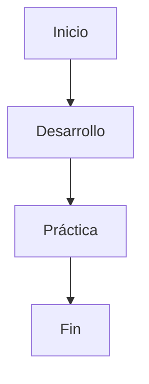

# Desarrollo del Curso 🛠️

Este documento muestra **otras funcionalidades de Markdown** para que veas más posibilidades.

---

## 1. Listas anidadas

- Tema 1
  - Subtema 1.1
    - Sub-subtema 1.1.1
  - Subtema 1.2
- Tema 2

---

## 2. Listas de tareas ✅

- [x] Completar la introducción
- [ ] Desarrollar los módulos
- [ ] Grabar las clases
- [ ] Publicar el curso

---

## 3. Separadores

Texto antes de un separador.

***

Texto después de un separador.

---

## 4. Texto con resaltado y notas

Puedes usar ==resaltado== (algunos motores de Markdown lo permiten).  

También puedes agregar notas al pie[^1].

[^1]: Esta es una nota al pie de ejemplo.

---

## 5. Definiciones

Término 1  
:   Esta es la definición del término 1.

Término 2  
:   Definición del término 2.

---

## 6. Diagramas con Mermaid

